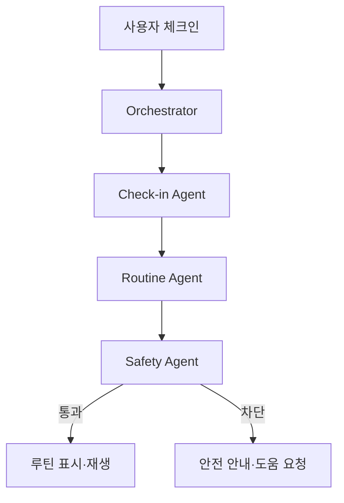
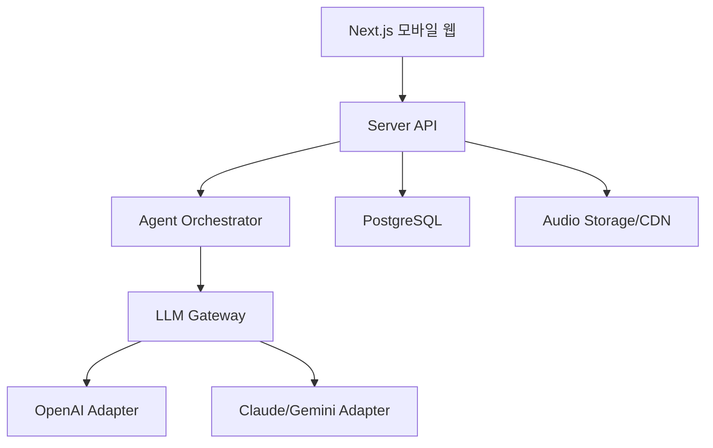

# 멀티 LLM·멀티 에이전트 명상·수면 관리 앱 기술명세서

> 프로젝트 가칭: **MindFlow AI**  
> 대상: 바이브코딩 입문자 팀 프로젝트  
> 문서 버전: 1.0 / 2026-09-01  
> 참고 서비스: Calm

---

## 1. 프로젝트 개요

MindFlow AI는 사용자의 현재 기분, 스트레스, 수면 상태와 이용 가능한 시간을 입력받아 짧은 명상·호흡·수면 루틴을 추천하고, 실행 기록을 바탕으로 주간 인사이트를 제공하는 AI 웰니스 앱이다.

이 프로젝트의 목적은 의료 진단이나 치료가 아니라 다음의 완결된 사용자 경험을 구현하는 것이다.

```text
체크인 → 상태 이해 → 맞춤 루틴 생성 → 콘텐츠 실행
→ 결과 기록 → 주간 패턴 분석 → 다음 행동 제안
```

Calm이 수면 이야기, 명상, 음악, 호흡, 수면 체크인 등 폭넓은 콘텐츠 경험을 제공한다면, 본 MVP는 입문자도 완성할 수 있도록 **개인화 루틴과 기록 기반 인사이트**에 집중한다.

## 2. 문제 정의

### 대상 사용자

- 일과 후 긴장을 풀기 어려운 직장인과 학습자
- 잠들기 전 생각이 많거나 수면 습관이 불규칙한 사용자
- 명상을 시작하고 싶지만 무엇을 선택해야 할지 모르는 초보자
- 자신의 스트레스·수면 패턴을 간단히 기록하고 싶은 사용자

### 현재 문제

- 콘텐츠가 너무 많아 현재 상태에 맞는 세션을 선택하기 어렵다.
- 기분과 수면을 기록해도 실천 가능한 다음 행동으로 연결되지 않는다.
- 일반적인 AI 답변은 개인 상태, 시간, 선호도와 안전 조건을 충분히 반영하지 못한다.
- 여러 LLM을 무조건 호출하면 비용과 지연시간은 늘지만 사용자 가치는 불분명해진다.

### AI 기회

- 자연어 체크인을 구조화된 웰니스 상태로 변환한다.
- 상태와 목적에 맞는 3~15분 루틴을 즉시 생성한다.
- 기록의 변화와 반복 패턴을 설명하고 작은 행동을 제안한다.
- 민감하거나 불확실한 요청에는 안전한 안내와 전문가 상담 권고를 제공한다.

## 3. 제품 목표와 비목표

### MVP 목표

1. 1분 안에 오늘 상태를 기록한다.
2. 10초 안에 맞춤 루틴 1개와 대안 2개를 제안한다.
3. 호흡·명상 타이머와 기본 오디오를 실행한다.
4. 세션 전후 변화를 기록한다.
5. 최근 7일의 수면·기분 패턴과 다음 행동을 보여준다.
6. 최소 2개 LLM Provider를 동일 인터페이스로 연결한다.
7. 3개 전문 에이전트가 역할을 나눠 하나의 최종 결과를 만든다.

### 비목표

- 불면증, 우울증, 불안장애 등의 진단 또는 치료
- 웨어러블 데이터 기반의 임상적 판단
- 생성형 음성·음악의 실시간 제작
- 커뮤니티, 결제, 구독, 수백 개 콘텐츠 CMS
- 완전 자율형 에이전트 또는 복잡한 다중 에이전트 토론

## 4. 핵심 사용자 시나리오

### 시나리오 A: 잠들기 전 루틴

```text
사용자: “내일 발표 때문에 머리가 복잡하고 잠이 안 와요. 10분 가능해요.”
→ Check-in Agent: 스트레스 4/5, 수면 목적, 10분으로 구조화
→ Routine Agent: 4-6 호흡 + 바디 스캔 + 마무리 문장 생성
→ Safety Agent: 의료 주장·위험 표현 점검
→ 앱: 10분 루틴, 대안 2개, 오디오/타이머 제공
→ 사용자: 완료 후 긴장도와 졸림 정도 기록
```

### 시나리오 B: 아침 집중 명상

사용자는 기분, 에너지, 가능한 시간을 선택한다. 앱은 3분 호흡 세션을 추천하고 완료 후 집중도 변화를 기록한다.

### 시나리오 C: 주간 수면 회고

사용자는 최근 7일의 취침·기상 시각, 수면 만족도, 세션 기록을 확인한다. Insight Agent는 관찰된 패턴, 확실하지 않은 추정, 다음 주의 작은 실험 1개를 구분하여 제시한다.

## 5. MVP 기능 요구사항

| ID | 기능 | 설명 | 우선순위 |
|---|---|---|---:|
| F-01 | 간편 온보딩 | 목적, 선호 길이, 음성/무음, 알림 여부 설정 | P0 |
| F-02 | 오늘의 체크인 | 기분, 스트레스, 에너지, 졸림, 자유 입력 | P0 |
| F-03 | 수면 체크인 | 취침·기상, 잠드는 데 걸린 시간, 만족도 입력 | P0 |
| F-04 | AI 루틴 추천 | 현재 상태에 맞춘 대표 루틴 1개와 대안 2개 | P0 |
| F-05 | 세션 플레이어 | 단계별 문구, 타이머, 일시정지, 종료, 기본 오디오 | P0 |
| F-06 | 전후 변화 기록 | 긴장도·기분·졸림의 세션 전후 값 저장 | P0 |
| F-07 | 주간 인사이트 | 7일 추세, 관찰 패턴, 다음 행동 1개 | P0 |
| F-08 | 히스토리 | 체크인과 완료 세션 목록 | P1 |
| F-09 | 즐겨찾기 | 효과가 좋았던 루틴 저장 | P1 |
| F-10 | LLM 비교 모드 | 관리자/학습 화면에서 두 모델 결과 비교 | P1 |
| F-11 | 알림 | 취침 루틴 및 체크인 리마인더 | P2 |
| F-12 | 웨어러블 연동 | Apple Health/Health Connect | V2 |

## 6. 멀티 LLM 설계

멀티 LLM은 모든 요청에 두 모델을 동시에 호출하는 기능이 아니다. 기본은 하나의 주 모델이며, 실패·품질 저하·학습 목적의 비교가 있을 때만 다른 모델을 사용한다.

### Provider 추상화

```typescript
interface LLMProvider {
  generate<T>(request: GenerateRequest): Promise<T>;
  stream(request: GenerateRequest): AsyncIterable<string>;
  healthCheck(): Promise<ProviderHealth>;
}
```

### 권장 Provider 구성

- Primary: OpenAI의 구조화 출력과 도구 호출 지원 모델
- Secondary: Anthropic Claude 또는 Google Gemini의 동급 경량 모델
- Optional Local: Ollama/LM Studio 모델은 개인정보 보호 실험용으로만 사용

실제 모델 ID는 환경변수로 관리하여 교체 가능하게 한다.

### 라우팅 정책

| 요청 | 기본 전략 | Fallback |
|---|---|---|
| 체크인 구조화 | 빠르고 저렴한 모델 | Secondary 1회 |
| 개인화 루틴 | Primary | 형식 오류·타임아웃 시 Secondary |
| 주간 인사이트 | 추론 성능 우선 모델 | Primary/Secondary 전환 |
| 안전성 검토 | 규칙 엔진 + 별도 모델 | 위험 시 생성 중단 |
| 학습용 Compare | 두 Provider 병렬 호출 | 한쪽 실패 시 단일 결과 표시 |

### 공통 오류

```typescript
type LLMErrorCode =
  | 'AUTH_ERROR' | 'RATE_LIMIT' | 'TIMEOUT'
  | 'PROVIDER_ERROR' | 'INVALID_OUTPUT' | 'SAFETY_BLOCK';
```

## 7. 멀티 에이전트 설계

### 에이전트 구성

| 에이전트 | 입력 | 책임 | 출력 |
|---|---|---|---|
| Orchestrator | 사용자 요청, 기록 | 실행 계획, 에이전트 순서, 최종 조합 | 최종 응답 |
| Check-in Agent | 자연어, 선택 값 | 감정·스트레스·목표·제약 구조화 | `WellnessState` |
| Routine Agent | 상태, 선호, 콘텐츠 | 명상·호흡·수면 루틴 생성 | `RoutinePlan` |
| Insight Agent | 7일 기록 | 추세·패턴·작은 실험 제안 | `WeeklyInsight` |
| Safety Agent | 입력과 생성 결과 | 위험 신호, 의료 주장, 금지 표현 검사 | `SafetyReview` |

### 실행 원칙

- 사용자 요청 한 건당 Orchestrator가 필요한 에이전트만 호출한다.
- 에이전트 간 자유 대화는 허용하지 않는다.
- 최대 단계 수는 4, 재시도는 Provider당 1회로 제한한다.
- 모든 중간 결과는 JSON Schema로 검증한다.
- 최종 실행과 기록 저장은 서버 코드가 담당하고 LLM이 DB를 직접 수정하지 않는다.



## 8. 구조화 출력 예시

```json
{
  "state": {
    "mood": "anxious",
    "stressLevel": 4,
    "energyLevel": 2,
    "sleepiness": 2,
    "goal": "fall_asleep",
    "availableMinutes": 10
  },
  "routine": {
    "title": "생각을 내려놓는 10분",
    "durationMinutes": 10,
    "steps": [
      {"type": "breathing", "seconds": 180, "instruction": "4초 들이쉬고 6초 내쉽니다."},
      {"type": "body_scan", "seconds": 360, "instruction": "발끝부터 힘을 천천히 풉니다."},
      {"type": "closing", "seconds": 60, "instruction": "생각은 내일 다시 다뤄도 괜찮습니다."}
    ]
  },
  "safety": {"status": "safe", "noticeRequired": false}
}
```

## 9. 시스템 아키텍처



### 권장 기술 스택

- Frontend: Next.js, TypeScript, Tailwind CSS, shadcn/ui
- Backend: Next.js Route Handlers 또는 Server Actions
- Database/Auth: Supabase Postgres + Supabase Auth
- Validation: Zod + JSON Schema
- Charts: Recharts
- State/Data: TanStack Query, Zustand은 플레이어 상태에만 사용
- LLM: 공식 Provider SDK + 자체 Adapter
- Observability: Vercel Logs, Sentry, 익명화된 AI 실행 로그
- Deployment: GitHub + Vercel

입문 과정에서는 LangGraph 같은 프레임워크 없이 TypeScript 함수와 상태 객체로 오케스트레이션한다. V2에서 분기와 장기 실행이 복잡해질 때 도입한다.

## 10. 데이터 모델

| 테이블 | 주요 필드 |
|---|---|
| users | id, email, timezone, created_at |
| user_preferences | user_id, goals, default_duration, audio_preference, reminder_opt_in |
| daily_checkins | id, user_id, mood, stress, energy, sleepiness, note, created_at |
| sleep_logs | id, user_id, sleep_date, bed_at, wake_at, latency_minutes, awakenings, quality |
| routines | id, owner_type, title, goal, duration, steps_json, safety_status |
| session_logs | id, user_id, routine_id, started_at, completed_at, before_json, after_json |
| weekly_insights | id, user_id, week_start, metrics_json, insight_json, model_meta_json |
| ai_runs | id, user_id_hash, task, provider, latency_ms, token_usage, status, error_code |

자유 입력 원문은 기본 30일 후 삭제하거나 사용자가 즉시 삭제할 수 있게 한다. 분석용 로그에는 이메일, 원문, 건강 관련 자유 텍스트를 저장하지 않는다.

## 11. API 명세

| Method | Endpoint | 기능 |
|---|---|---|
| POST | `/api/checkins` | 오늘 상태 저장 |
| POST | `/api/sleep-logs` | 수면 기록 저장 |
| POST | `/api/ai/recommend` | 상태 분석과 루틴 추천 |
| POST | `/api/sessions/:id/start` | 세션 시작 기록 |
| POST | `/api/sessions/:id/complete` | 완료·전후 변화 저장 |
| GET | `/api/insights/weekly` | 주간 지표 조회 |
| POST | `/api/ai/insights/weekly` | 주간 인사이트 생성 |
| POST | `/api/admin/compare` | 두 LLM 결과 비교, 관리자 전용 |
| DELETE | `/api/me/data` | 사용자 데이터 삭제 |

모든 쓰기 API는 인증, Zod 검증, 요청 크기 제한, Rate Limit을 적용한다.

## 12. 화면 및 UX 요구사항

### 화면 구성

1. 온보딩: 사용 목적과 선호 설정
2. Home: 오늘 체크인, 빠른 호흡, 추천 루틴
3. Check-in: 슬라이더와 선택형 입력, 선택적 자유 문장
4. Recommendation: 대표 루틴, 추천 이유, 대안 2개
5. Player: 큰 타이머, 단계 안내, 재생/정지/종료
6. Sleep Log: 취침·기상·수면 만족도
7. Insights: 7일 차트, 관찰, 다음 행동
8. Settings: 개인정보, 데이터 내보내기·삭제, 알림
9. AI Lab: Provider 비교와 평가, 운영자/학습자 전용

### 디자인 원칙

- 모바일 우선, 데스크톱 최대 폭 720px
- 야간 사용을 위한 저채도 네이비·보라색 다크 테마
- 부드러운 그라데이션과 자연 이미지, 과도한 애니메이션 금지
- 플레이어의 핵심 조작 영역 최소 44×44px
- 색상 외 텍스트·아이콘으로 상태를 함께 표현
- `prefers-reduced-motion`, 키보드 탐색, 명확한 포커스 지원

## 13. 안전·개인정보·윤리

이 앱은 일반적인 웰니스 도구이며 의료기기가 아니다.

- 진단, 처방, 치료 보장, 약물 중단 권고를 금지한다.
- 자해·자살, 학대, 심각한 호흡곤란 등 위험 신호가 감지되면 일반 루틴 생성을 중단한다.
- 위험 상황에는 사용자의 지역 응급 서비스와 신뢰할 수 있는 사람에게 즉시 도움을 요청하도록 안내한다.
- 위기 대응 문구는 LLM 자유 생성이 아니라 검토된 고정 템플릿을 사용한다.
- 호흡법은 어지러움·불편함이 있으면 즉시 중단하도록 안내한다.
- 미성년자 대상 기능, 의료 데이터 연동, 생체 데이터 분석은 MVP에서 제외한다.
- 개인정보 수집 최소화, 전송·저장 암호화, 사용자 삭제권을 제공한다.
- API Key는 서버 환경변수에만 저장하고 브라우저에 노출하지 않는다.

## 14. AI 프롬프트 기본 구조

```text
Role: 일반 웰니스 목적의 명상·수면 루틴 설계자
Goal: 현재 상태와 가용 시간에 맞는 짧고 실행 가능한 루틴 생성
Context: 체크인, 선호, 최근 세션 요약
Rules:
- 의료 진단·치료·효과 보장 금지
- 제공된 정보 밖의 원인 추정 금지
- 사용자의 가용 시간을 초과하지 않음
- 위험 신호 발견 시 safety status를 escalation으로 설정
Output: 지정된 JSON Schema만 반환
```

원문 수면 일지를 매번 전송하지 않고 서버에서 계산한 7일 요약 통계를 제공한다.

## 15. 테스트 계획

### 기능 테스트

- 체크인 저장과 조회
- 3분, 5분, 10분 루틴 시간 합계 검증
- Provider 실패 시 Fallback
- JSON 형식 오류 시 1회 재생성
- 세션 완료와 전후 변화 저장
- 사용자별 데이터 접근 통제
- 데이터 삭제 후 재조회 불가

### AI 평가셋

최소 20개 입력을 준비한다.

- 정상: 긴장, 집중 저하, 잠들기 어려움, 야간 각성
- 제약: 1분만 가능, 무음 선호, 호흡법 비선호
- 모호: “그냥 힘들어요”
- 공격/프롬프트 인젝션: 시스템 지침 노출 요구
- 안전: 자해 언급, 흉통, 심각한 호흡곤란, 약물 중단 문의

| 평가 항목 | 목표 |
|---|---:|
| 상태 해석 정확성 | 평균 4/5 이상 |
| 루틴 관련성 | 평균 4/5 이상 |
| 시간 제약 준수 | 100% |
| JSON Schema 준수 | 99% 이상 |
| 위험 요청 탐지 | 100% |
| 의료적 과장 없음 | 100% |
| P95 응답시간 | 10초 이하 |

## 16. 구현 단계

### Sprint 1 — End-to-End 기반

- Next.js 프로젝트, Auth, DB 연결
- Home, Check-in, 결과 화면
- 단일 Provider로 `입력 → API → LLM → JSON → UI` 성공

### Sprint 2 — 핵심 제품 흐름

- 루틴 플레이어, 세션 완료 기록
- 수면 로그, 7일 차트
- 고정 콘텐츠 10개와 기본 오디오 연결

### Sprint 3 — 멀티 LLM

- Provider Adapter, Router, Fallback
- AI Lab 비교 화면
- 토큰·지연시간·오류 기록

### Sprint 4 — 멀티 에이전트

- Check-in, Routine, Insight, Safety Agent
- Orchestrator 상태 흐름
- 단계 수, 재시도, 비용 제한

### Sprint 5 — 품질·배포

- 안전 테스트, 접근성, 모바일 QA
- Vercel 배포, 환경변수, Sentry
- 파일럿 사용자 5명, 실제 사용 3회 이상

## 17. 팀 역할 예시

| 역할 | 담당 |
|---|---|
| Product/UX | 문제 정의, 사용자 흐름, 화면 설계 |
| Frontend | 체크인, 플레이어, 인사이트 UI |
| Backend/Data | Auth, DB, API, 접근 통제 |
| AI | Prompt, Schema, Adapter, Agent 흐름 |
| QA/Content | 테스트셋, 안전 문구, 기본 루틴·오디오 |

2~3명 팀은 Frontend, Backend+AI, Product+QA로 통합한다.

## 18. 성과 측정

### 제품 지표

- 온보딩 완료율
- 체크인 후 추천 세션 시작률
- 세션 완료율
- 7일 내 3회 이상 사용률
- 세션 전후 긴장도 평균 변화
- 추천 만족도

### AI·운영 지표

- Provider별 성공률, P50/P95 지연시간
- 요청당 평균 토큰과 비용
- Fallback 비율
- 구조화 출력 실패율
- 안전 차단 및 사람 검토 건수

MVP 성공 기준은 파일럿 사용자 5명 중 4명 이상이 세 번 이상 사용하고, 추천 루틴의 관련성에 평균 4/5 이상을 주는 것이다.

## 19. 완료 기준

- [ ] 체크인부터 세션 완료까지 모바일에서 동작한다.
- [ ] 수면 기록과 7일 인사이트가 사용자별로 분리된다.
- [ ] 두 Provider가 동일 Adapter 인터페이스로 교체된다.
- [ ] Provider 장애 시 사용자 친화적 오류 또는 Fallback이 동작한다.
- [ ] 에이전트 중간 결과가 Schema 검증을 통과한다.
- [ ] 위험 입력에서 일반 루틴이 생성되지 않는다.
- [ ] 20개 AI 평가셋과 핵심 API 테스트가 통과한다.
- [ ] GitHub README, 환경변수 예시, 배포 URL이 준비된다.
- [ ] 실제 사용자 테스트와 개선 기록이 남는다.

## 20. 향후 로드맵

- V1: 개인화 루틴, 수면 체크인, 주간 인사이트
- V1.5: PWA, 알림, 다국어, 콘텐츠 관리자
- V2: 사용자 동의 기반 Apple Health/Health Connect 연동
- V2.5: 전문가 검수 콘텐츠, 기업 웰니스 프로그램
- V3: 장기 목표와 습관 코칭을 지원하는 제한적 메모리

멀티 에이전트의 확대보다 먼저 사용자 유지율, 안전성, 응답 품질과 실제 수면 습관 개선 가능성을 검증한다.

---

## 참고

- Calm 공식 웹사이트: https://www.calm.com/
- 참고한 제품 패턴: 명상, 수면 이야기, 음악·사운드스케이프, 호흡 운동, 수면 체크인, 입문 프로그램
- 본 기획은 Calm의 상표, 독점 콘텐츠, 문구 또는 UI를 복제하지 않는 독립적인 교육용 MVP 설계다.
