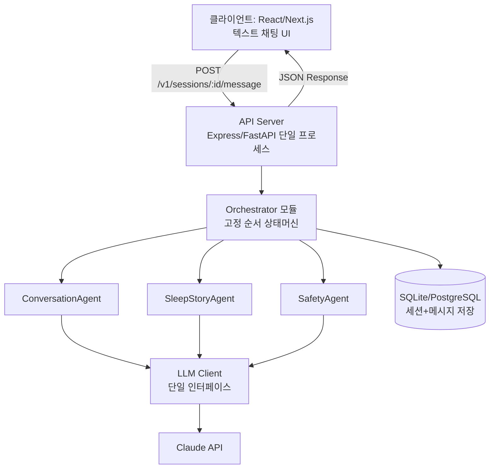
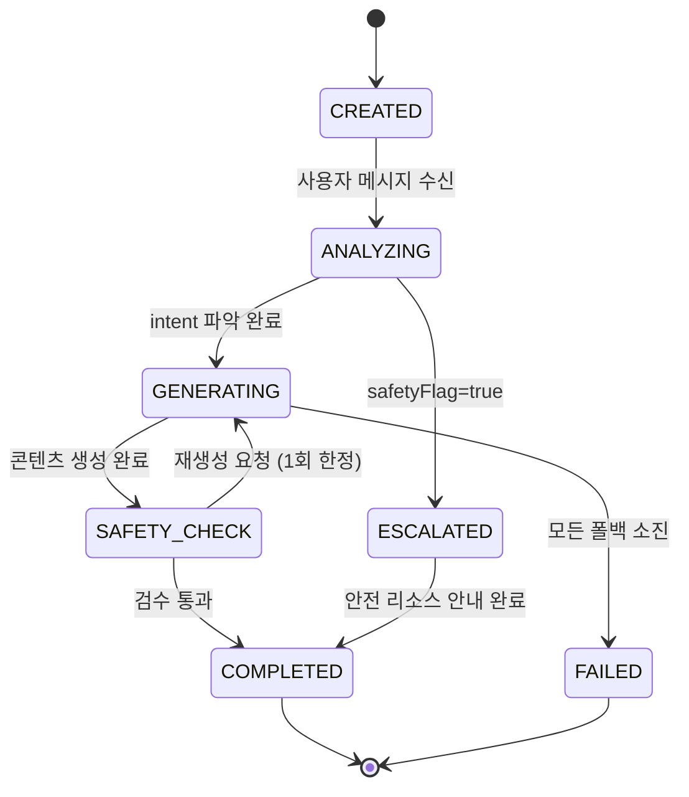
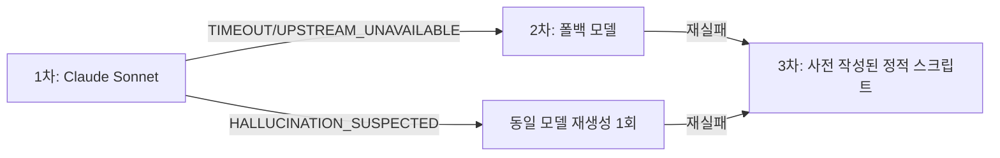

# 명상·수면 앱 실행형 기술명세서 (Executable Spec, 멀티 LLM·멀티 에이전트)

2026-09-18 · @Someone

## 1. MVP 스코프 컷 (V1 vs V2)

> **원칙**: V1은 "텍스트 입력 → 상태 관리 → JSON 기반 에이전트 협업 → 텍스트 응답" 루프만 완전히 동작시킨다. 오디오/음성은 UI에 슬롯만 두고 목업 처리한다.

| 기능 | V1 (MVP, 지금 구현) | V2 (이후 확장) |
| --- | --- | --- |
| 세션 입출력 | 텍스트 채팅 UI, JSON 상태 응답 | 실시간 음성 대화(STT/TTS) |
| 수면 스토리 | 텍스트 스크립트 생성·표시 | 음성 내레이션 자동 합성 |
| 사운드스케이프 | 정적 사운드 파일 1곡 매핑(고정 트랙 ID 선택만) | 실시간 오디오 믹싱·바이노럴비트 엔진 |
| 에이전트 오케스트레이션 | 순차 파이프라인(고정 순서, 단순 상태머신) | 동적 플래너 기반 자유 오케스트레이션 |
| 위기 개입(Crisis) | 고정 텍스트 스크립트 + 안전 리소스 안내(LLM 미개입) | 저지연 실시간 음성 개입 |
| 멀티디바이스 동기화 | 미포함 | 포함 |
| 웨어러블 연동 | 미포함 | 포함 |

**V1 완료 정의(Definition of Done)**: 사용자가 텍스트로 요청 → Orchestrator가 최소 2개 에이전트(Conversation, Sleep Story)를 순차 호출 → 각 에이전트가 정의된 JSON 스키마로 응답 → 화면에 텍스트로 렌더링. 이 루프가 안정적으로 동작하면 V1 성공.

## 2. 단순화된 시스템 아키텍처 (V1 기준)

실시간 오디오 스트리밍, WebSocket 등을 걷어내고 REST 요청/응답 + JSON 상태 전이만으로 구성한다. AI 코딩 도구가 한 번에 이해할 수 있도록 모놀리식 백엔드 하나에 에이전트를 모듈로 둔다.



**V1 아키텍처 결정 사항**

- 세션 상태는 Redis 대신 DB 테이블(`sessions.state_json`)에 직접 저장 — 인프라 단순화.
- 에이전트 간 통신은 실제 네트워크 호출이 아니라 **같은 프로세스 내 함수 호출**(TypeScript 함수/Python 클래스 메서드)로 구현 — MCP/네트워크 프로토콜은 V2에서 도입.
- LLM은 단일 모델(Claude)로 먼저 전체 루프를 완성한 뒤(Stage 2), 멀티 LLM 라우팅은 Stage 3에서 추가(7장 참조).
- 오디오는 미리 준비된 정적 파일 3\~5개 중 하나를 `mood` 값에 따라 매핑하는 룩업 테이블로 대체.

## 3. 데이터 스키마 및 타입 정의

AI 코딩 도구가 그대로 복사해 파일로 만들 수 있는 형태로 정의한다. 아래 타입들은 `types/agent.ts`, `types/db.ts`, `types/llm.ts`에 각각 배치할 것을 권장한다.

### 3.1 에이전트 간 통신 인터페이스 (`types/agent.ts`)

```typescript
// 에이전트가 처리할 수 있는 작업 종류
export enum AgentTask {
  ANALYZE_INTENT = "ANALYZE_INTENT",
  GENERATE_SLEEP_STORY = "GENERATE_SLEEP_STORY",
  SAFETY_CHECK = "SAFETY_CHECK",
  SUGGEST_COACHING = "SUGGEST_COACHING",
}

export enum AgentName {
  CONVERSATION = "CONVERSATION",
  SLEEP_STORY = "SLEEP_STORY",
  SAFETY = "SAFETY",
  COACHING = "COACHING",
  ANALYTICS = "ANALYTICS",
}

// Orchestrator -> Agent 요청
export interface AgentRequest {
  requestId: string;          // uuid, 트레이싱용
  task: AgentTask;
  sessionId: string;
  context: SessionContext;    // 아래 3.2 참조
  deadlineMs: number;         // 이 시간 내 응답 없으면 타임아웃 처리
}

// Agent -> Orchestrator 응답 (모든 에이전트 공통 포맷)
export interface AgentResponse<T = unknown> {
  requestId: string;
  agent: AgentName;
  status: AgentResponseStatus;
  result: T | null;
  modelUsed: string | null;   // 예: "claude-sonnet-4-6"
  latencyMs: number;
  error: AgentError | null;
}

export enum AgentResponseStatus {
  SUCCESS = "SUCCESS",
  PARTIAL = "PARTIAL",       // 일부 필드만 채움 (폴백 결과)
  FAILED = "FAILED",
}

export interface AgentError {
  code: LlmErrorCode;         // 4장 Enum 참조
  message: string;
  retryable: boolean;
}

// ConversationAgent 결과 스키마
export interface IntentAnalysisResult {
  intent: "sleep" | "stress_sos" | "meditation" | "coaching" | "unknown";
  mood: "anxious" | "neutral" | "sad" | "calm" | "stressed";
  confidence: number; // 0.0 ~ 1.0
}

// SleepStoryAgent 결과 스키마
export interface SleepStoryResult {
  title: string;
  script: string;      // V1: 텍스트만. V2에서 audioUrl 추가
  themeTag: string;
}
```

### 3.2 세션 컨텍스트 (에이전트 간 공유 상태)

```typescript
export interface SessionContext {
  sessionId: string;
  userId: string;
  userState: {
    mood: string | null;
    goal: string | null;
  };
  agentOutputs: Partial<{
    conversation: IntentAnalysisResult;
    sleepStory: SleepStoryResult;
  }>;
  safetyFlag: boolean; // true면 즉시 안전 경로로 강제 전환
}
```

### 3.3 DB 모델 (`types/db.ts`, Prisma/SQLAlchemy 스키마와 1:1 대응)

```typescript
export interface UserRecord {
  id: string;
  email: string;
  planTier: "free" | "pro";
  createdAt: string; // ISO 8601
}

export interface SessionRecord {
  id: string;
  userId: string;
  type: "meditation" | "sleep" | "coaching";
  status: SessionStatus; // 4장 Enum 참조
  stateJson: SessionContext;
  createdAt: string;
  updatedAt: string;
}

export interface MessageRecord {
  id: string;
  sessionId: string;
  role: "user" | "agent";
  agentName: AgentName | null;
  content: string;
  createdAt: string;
}
```

## 4. 상태머신 및 Enum 정의

### 4.1 세션 상태머신



```typescript
export enum SessionStatus {
  CREATED = "CREATED",
  ANALYZING = "ANALYZING",
  GENERATING = "GENERATING",
  SAFETY_CHECK = "SAFETY_CHECK",
  ESCALATED = "ESCALATED",   // 위기 개입 경로로 강제 전환됨
  COMPLETED = "COMPLETED",
  FAILED = "FAILED",
}
```

### 4.2 LLM 에러 코드 (모든 에이전트가 공통으로 사용)

```typescript
export enum LlmErrorCode {
  TIMEOUT = "TIMEOUT",                     // deadlineMs 초과
  TOKEN_LIMIT_EXCEEDED = "TOKEN_LIMIT_EXCEEDED",
  RATE_LIMITED = "RATE_LIMITED",           // 429
  CONTENT_FILTERED = "CONTENT_FILTERED",   // 벤더 안전필터에 의해 차단
  HALLUCINATION_SUSPECTED = "HALLUCINATION_SUSPECTED", // 6장 검증 로직에서 판정
  INVALID_SCHEMA = "INVALID_SCHEMA",       // 응답이 정의된 JSON 스키마를 위반
  UPSTREAM_UNAVAILABLE = "UPSTREAM_UNAVAILABLE", // 벤더 API 5xx
  UNKNOWN = "UNKNOWN",
}
```

### 4.3 재시도 가능 여부 매핑

| 에러 코드 | `retryable` | 기본 대응 |
| --- | --- | --- |
| TIMEOUT | true | 같은 모델 1회 재시도 → 실패 시 폴백 모델 |
| TOKEN\_LIMIT\_EXCEEDED | false | 입력 길이 축소 후 재생성 (6장) |
| RATE\_LIMITED | true | 지수 백오프 후 재시도, 3회 초과 시 폴백 모델 |
| CONTENT\_FILTERED | false | 프롬프트 안전 문구 강화 후 1회 재생성, 재발 시 정적 콘텐츠로 대체 |
| HALLUCINATION\_SUSPECTED | false | 정적 검증 실패 콘텐츠 폐기, 재생성 |
| INVALID\_SCHEMA | true | JSON 파싱 재시도 1회, 실패 시 폴백 모델 |
| UPSTREAM\_UNAVAILABLE | true | 즉시 폴백 모델로 전환 |

## 5. API 스펙 (요청/응답 타입 명시)

V1은 REST만 사용한다(WebSocket/스트리밍은 V2).

```typescript
// POST /v1/sessions
export interface CreateSessionRequest {
  userId: string;
  type: "meditation" | "sleep" | "coaching";
}
export interface CreateSessionResponse {
  sessionId: string;
  status: SessionStatus;
}

// POST /v1/sessions/:id/message
export interface PostMessageRequest {
  message: string;
}
export interface PostMessageResponse {
  sessionId: string;
  status: SessionStatus;
  agentTrace: AgentResponse[];      // 이번 턴에 호출된 에이전트들의 응답 배열(디버깅용, 3.1 참조)
  reply: {
    text: string;                   // 사용자에게 보여줄 최종 텍스트
    storyResult: SleepStoryResult | null;
  };
  error: AgentError | null;
}

// GET /v1/sessions/:id
export interface GetSessionResponse {
  session: SessionRecord;
  messages: MessageRecord[];
}
```

**HTTP 상태 코드 매핑**

| 상황 | HTTP 코드 | 바디 |
| --- | --- | --- |
| 정상 처리(에이전트 폴백 포함) | 200 | `PostMessageResponse`, `status`는 `COMPLETED` 또는 `ESCALATED` |
| 모든 폴백 소진 | 200 | `status: FAILED`, `error` 필드에 원인 명시 (클라이언트가 UI로 안내하도록 200 유지) |
| 잘못된 요청(스키마 위반) | 400 | `{ code: "BAD_REQUEST", message }` |
| 세션 없음 | 404 | `{ code: "SESSION_NOT_FOUND" }` |
| 서버 내부 오류(예상 못한 예외) | 500 | `{ code: "INTERNAL_ERROR" }` |

> LLM/에이전트 실패는 원칙적으로 500이 아니라 200 + `status: FAILED`로 응답한다 — 클라이언트가 항상 정해진 스키마로 결과를 받아 처리할 수 있게 하기 위함(6장 Fallback 정책과 연동).

## 6. 에러 처리 및 Fallback 정책

### 6.1 타임아웃

- `AgentRequest.deadlineMs` 기본값: 일반 대화 5000ms, 위기개입(SAFETY) 1500ms.
- 초과 시 `LlmErrorCode.TIMEOUT` 반환 → 같은 모델 1회 재시도(지터 포함 짧은 대기) → 재실패 시 폴백 모델로 전환 → 폴백도 실패하면 `AgentResponseStatus.FAILED` + 정적 안내 문구 반환.

### 6.2 토큰 초과

- 입력 전송 전 토큰 카운터로 사전 검사(예: `tiktoken` 유사 라이브러리).
- 한도 초과 예상 시 대화 히스토리를 최근 N턴으로 요약·절단 후 재구성, 그래도 초과하면 `TOKEN_LIMIT_EXCEEDED` 반환하고 사용자에게 "조금 더 짧게 말씀해 주세요" 안내.

### 6.3 환각(Hallucination) 검증

LLM 응답을 그대로 신뢰하지 않고, 응답 후 **경량 규칙 기반 검증기**를 반드시 통과시킨다.

```typescript
export interface HallucinationCheckResult {
  passed: boolean;
  reasons: string[];
}

export function checkHallucination(
  result: SleepStoryResult
): HallucinationCheckResult {
  const reasons: string[] = [];
  // 예: 의학적 진단/처방 표현 포함 여부
  if (/진단|처방|치료제|복용량/.test(result.script)) {
    reasons.push("medical_claim_detected");
  }
  // 예: 응답이 요청한 스키마 필드를 채우지 못함
  if (!result.title || result.script.length < 50) {
    reasons.push("incomplete_output");
  }
  return { passed: reasons.length === 0, reasons };
}
```

- 검증 실패 시 `LlmErrorCode.HALLUCINATION_SUSPECTED`로 처리하고 **재생성은 최대 1회만** 허용(무한 루프 방지), 재실패 시 사전 작성된 정적 콘텐츠로 대체.

### 6.4 폴백 체인 (모델 캐스케이드)



### 6.5 위기 개입(Crisis) 전용 안전장치

- Crisis 경로는 **LLM 호출 자체를 우회 가능**해야 한다 — 사전 검증된 정적 스크립트 배열에서 즉시 선택해 반환하는 것을 기본값으로 하고, LLM 생성은 어디까지나 보조 옵션으로만 둔다.
- `safetyFlag: true`가 감지되면 이후 모든 폴백 로직을 건너뛰고 즉시 `ESCALATED` 상태로 전이.

## 7. 구현 스프린트: Chunk 단위 태스크 분배

AI 코딩 에이전트(Claude Code, Cursor 등)에게 한 청크씩 통째로 지시할 수 있도록 나눴다. 각 청크는 "완료 조건"을 명시해 다음 청크로 넘어갈 기준을 명확히 한다.

### Stage 1 — 뼈대 및 기본 API 라우팅 (LLM 연결 없음)

| Chunk | 지시 내용 | 완료 조건 |
| --- | --- | --- |
| 1-1 | 프로젝트 스캐폴딩: 백엔드(Express/FastAPI) + 프론트(Next.js) 초기 세팅, 3장의 타입 파일 생성 | `npm run dev`로 양쪽 서버 기동 |
| 1-2 | DB 스키마 마이그레이션(3.3 모델 기준), `SessionRecord`/`MessageRecord` CRUD | 세션 생성·조회 API가 목업 데이터로 200 응답 |
| 1-3 | `POST /v1/sessions`, `POST /v1/sessions/:id/message`(에이전트 호출 없이 echo 응답) 라우팅 구현 | 프론트에서 메시지를 보내면 화면에 echo가 표시됨 |
| 1-4 | 프론트 텍스트 채팅 UI(입력창, 메시지 리스트, 로딩 상태) | 실제 서버와 연동해 대화 흐름이 화면에서 확인됨 |

### Stage 2 — 단일 LLM을 통한 코어 로직 완성

| Chunk | 지시 내용 | 완료 조건 |
| --- | --- | --- |
| 2-1 | `ConversationAgent` 구현: Claude 호출 1회로 `IntentAnalysisResult` 생성(3.1 스키마 강제, JSON 모드) | 임의 입력에 대해 intent/mood가 스키마대로 반환 |
| 2-2 | `SleepStoryAgent` 구현: intent=sleep일 때 스토리 생성 | 생성된 스토리가 화면에 표시됨 |
| 2-3 | `SafetyAgent`(규칙 기반, 6.3 검증기) 및 Orchestrator 상태머신(4.1) 연결 | 전체 파이프라인이 CREATED→...→COMPLETED로 정상 전이 |
| 2-4 | 6장 에러 처리(타임아웃, 재시도 1회) 구현 | 강제로 타임아웃을 유발해도 앱이 죽지 않고 FAILED 응답 반환 |

### Stage 3 — 멀티 LLM 연동

| Chunk | 지시 내용 | 완료 조건 |
| --- | --- | --- |
| 3-1 | LLM 게이트웨이 추상화 레이어 도입(벤더 무관 공통 인터페이스) | 모델을 설정값 하나로 교체 가능 |
| 3-2 | 라우팅 정책 구현: 작업 유형별 1차/폴백 모델 매핑 테이블 적용 | 1차 모델 강제 실패 시 폴백 모델로 자동 전환되는 것이 로그로 확인됨 |
| 3-3 | `CoachingAgent`, `AnalyticsAgent` 추가 및 비용 효율 모델 적용 | 신규 에이전트가 기존 오케스트레이터 수정 없이 플러그인처럼 등록됨 |
| 3-4 | Crisis 경로(정적 스크립트 우선, LLM 우회) 구현 | 위기 개입 요청이 1.5초 이내 항상 응답 |

**AI 코딩 도구 프롬프팅 팁**: 각 Chunk를 요청할 때 "이 문서의 N장을 참고해서 Chunk X-Y만 구현해줘. 다른 Chunk는 건드리지 마"라고 명시하면 범위 이탈을 막을 수 있다.

## 8. V2 로드맵: 컷된 기능과 재도입 조건

| 기능 | V1에서 제외한 이유 | V2 재도입 조건 |
| --- | --- | --- |
| 실시간 음성 대화(STT/TTS) | 디버깅 난이도 높음(오디오 스트리밍, 지연 튜닝) | Stage 3 완료 + 텍스트 루프 안정화 확인 후 |
| 실시간 오디오 믹싱·바이노럴비트 | 신호처리 로직 복잡, MVP 검증에 불필요 | 사용자 리텐션 지표로 콘텐츠 다양성 수요 확인 후 |
| 동적 플래너 기반 자유 오케스트레이션 | 고정 순서 상태머신 대비 디버깅 어려움 | 에이전트 수 6개 이상으로 늘어나 고정 순서로 한계 발생 시 |
| WebSocket 실시간 스트리밍 | REST로도 MVP 검증 가능, 인프라 복잡도 증가 | 응답 체감 지연이 사용자 이탈로 이어짐이 데이터로 확인될 때 |
| 멀티디바이스 동기화 | 계정/세션 동기화 로직 별도 필요 | 웹+모바일 동시 사용자 비율이 유의미해질 때 |
| 웨어러블 실시간 심박 연동 | 하드웨어 연동 리소스 큼 | 핵심 루프의 PMF 확인 후 |

> V1에서 확정한 타입(3장)과 상태머신(4장)은 V2에서도 그대로 확장해 사용하도록 설계되어 있어, 재작성 없이 필드/에이전트만 추가하면 된다.
